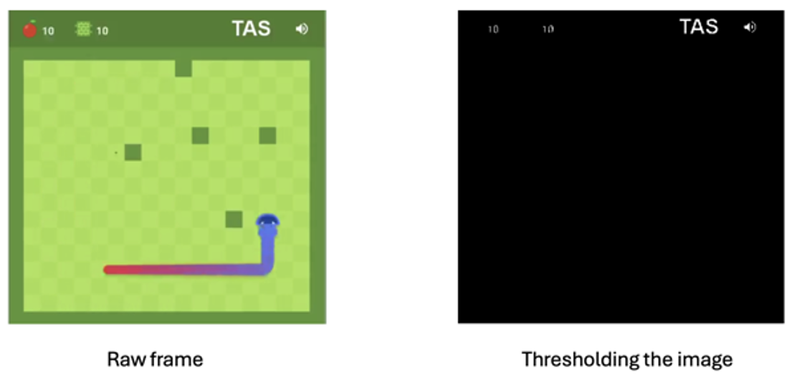
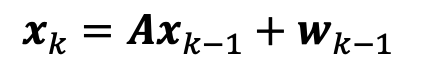

# 2-D Kalman Filter for Tracking the Snake in Google Snake Gameplay Video  

🌟 Accompanying code for the tutorial: **"Object Tracking: 2-D Object Tracking Using Kalman Filter in Python"**  
**Tutorial link:** [Object Tracking with Kalman Filter](https://machinelearningspace.com/2d-object-tracking-using-kalman-filter/)  

🌟 GitHub repository: [RahmadSadli/2-D-Kalman-Filter](https://github.com/RahmadSadli/2-D-Kalman-Filter.git)  

---

## Abstract
- In a simple game like **Google Snake**, the goal is to detect the snake's head and create a path that shows its movement. Specifically, this involves tracking the snake's head position across frames.  
- For a traditional approach, each frame is converted to grayscale, and thresholding is applied to detect the white part of the eyes on the snake's head. However, this method may encounter challenges, as the white part of the eyes is not visible in every frame.  

---

---

🥹 **Challenge:** When the snake's eyes cannot be captured.  

---

## Method
✨ While there are more advanced object detection methods available, such as:  
- Detecting the two ends of the snake,  
- Capturing the blue part of the snake, or  
- Using deep learning models,  

I chose to apply the **Kalman Filter** for this project. Precise detection methods are not the focus of this work.

The **Kalman Filter** is based on kinematic equations, which relate position and velocity. Using these equations:  
,  
the Kalman Filter determines the state of a system over time using a linear stochastic difference equation:  
  

Here, \(x_k\) is the state vector representing the snake's head position and velocity in the \(x\) and \(y\) coordinates. It can be defined as:  
  

The measurement model, which describes the relationship between the state and observation, is given by:  
  

---

## Environment Setup
| **Name**              | **Description**         |
|-----------------------|-------------------------|
| OS                   | MacOS                  |
| Programming Language | Python 3.8.13          |
| Libraries            | OpenCV, Numpy, Matplotlib, Seaborn |

---

## Result
- Using the Kalman Filter's prediction and estimation steps, I updated the state vector for every frame in the video. Based on these results, rectangles were drawn on each video frame to mark the results of both traditional and Kalman Filter-based detection.

  

- Although the estimated positions obtained using traditional methods are unavailable in some frames, the overall result is satisfactory.  
- To further improve the accuracy of estimated positions using Bayesian filtering, equations can be refined to ensure constant velocity across all directions.  
